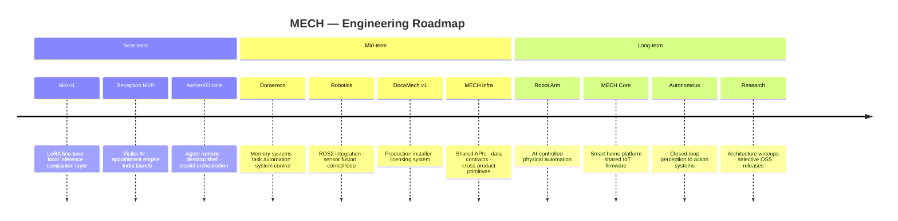

  

 

<h1 align="center">Vaibhav Kumar</h1>

  AI systems engineer and founder building <strong>MECH</strong> — 
  software intelligence connected to physical hardware.  
  <em>Local LLMs &nbsp;·&nbsp; Robotics &nbsp;·&nbsp; Desktop Software &nbsp;·&nbsp; Autonomous Systems</em>

  
  &nbsp;
  
  &nbsp;
  

---

## About

I build AI systems, robotics software, and desktop applications. Most of what I work on lives under **MECH** — a company I'm building at the intersection of machine intelligence and physical automation.

Day to day: training language models from custom datasets, writing computer vision pipelines, shipping desktop tools, and prototyping hardware. Long-term interest: closed-loop systems where AI reasoning drives physical action.

Currently deepening work across local LLM deployment, robotics middleware (ROS2), and production-grade desktop AI infrastructure.

---

## MECH

<em>An AI &amp; Robotics company. Every product shares the same long-term infrastructure — intelligence that compounds across systems, not contained within them.</em>

 

**Software Products**

| Product | Category | Description | Status |
|:--------|:---------|:------------|:------:|
| **Mio** | AI Companion | Anime-inspired conversational AI fine-tuned on a 1M+ conversation dataset. Local LLM deployment, built for long-term memory and deep personalization — not another wrapper | `Active` |
| **Reception** | B2B SaaS | AI receptionist platform — visitor management, appointment handling, and enterprise conversation. India and international markets | `Active` |
| **AetherXD** | Desktop Platform | Unified local AI, automation, and agent runtime for desktop. Daily-driver environment for builders who want intelligence on-device | `Active` |
| **Revolver D** | Content Pipeline | End-to-end AI-assisted video production, design automation, and asset generation | `Active` |
| **DocaMech** | Utility | Automatic file organizer. Monitors Downloads, auto-sorts by type. Ships with a licensing system and Windows installer | `Prototype` |
| **Doraemon** | Personal AI | Full memory, task automation, and system control. Long-term AI infrastructure layer — the platform behind the companion | `Planned` |

 

**Hardware Roadmap**

| System | Description | Horizon |
|:-------|:------------|:-------:|
| **Robot Arm** | AI-controlled physical automation, integrated with the MECH software stack | `Future` |
| **MECH Core** | Shared IoT firmware platform: Tank Level Checker · Auto Motor Controller · Leak Detector · Environment Monitor | `Planned` |
| **Rail System** | Automated workspace equipment transport via rail-mounted actuators | `Future` |
| **Smart Projector** | AI-driven dynamic information surfaces in physical space | `Concept` |
| **VR Workspace** | Immersive spatial environment for AI-integrated productivity | `Concept` |

---

## Current Focus

**Building**

| Project | What is happening |
|:--------|:------------------|
| **Mio v1** | Dataset pipeline complete → LoRA fine-tuning → local inference deployment |
| **Reception** | MVP feature set → India go-to-market |
| **AetherXD** | Agent runtime core → desktop shell → model orchestration layer |
| **MECH infrastructure** | Shared APIs, data contracts, and reusable primitives across all MECH products |

 

**Learning**

| Subject | Context |
|:--------|:--------|
| **Rust** | Systems programming for performance-critical MECH components |
| **ROS2** | Robotics middleware — foundation for the MECH hardware stack |
| **Deep Learning** | Theoretical foundations via fast.ai, deeplearning.ai, and building from scratch |
| **Autonomous Systems** | SLAM, navigation, sensor fusion, and control theory |
| **Robotics** | Kinematics, motion planning, and embedded control |

---

## Technology

**Languages**

  

Python &nbsp;·&nbsp; TypeScript &nbsp;·&nbsp; JavaScript &nbsp;·&nbsp; C++ &nbsp;·&nbsp; C# &nbsp;·&nbsp; Rust <em>(learning)</em>

  

**AI / ML**

  

PyTorch &nbsp;·&nbsp; TensorFlow &nbsp;·&nbsp; Hugging Face Transformers &nbsp;·&nbsp; LangChain &nbsp;·&nbsp; Ollama &nbsp;·&nbsp; OpenCV &nbsp;·&nbsp; MediaPipe &nbsp;·&nbsp; RAG Pipelines &nbsp;·&nbsp; LoRA fine-tuning &nbsp;·&nbsp; Local LLM deployment

  

**Web & Backend**

  

 

**Desktop & 3D**

  

 

**Infrastructure**

  

 

**Databases**

  

 

**Hardware**

  
  &nbsp;
  
  &nbsp;
  

---

## Research & Engineering

<table>
<tr>
<td valign="top" width="50%">

**Computer Vision**

Real-time detection, tracking, and AI-assisted vision pipelines deployed as services.

→ [`emotion-detection-project`](https://github.com/brovk2008/emotion-detection-project) &nbsp; [`rain-detect`](https://github.com/brovk2008/rain-detect)

`OpenCV` `MediaPipe` `Flask` `Webcam processing` `Model serving`

</td>
<td valign="top" width="50%">

**Local AI Research**

RAG pipelines, transformer training from scratch, and local inference orchestration — ownership, latency, reproducibility.

→ [`RAG-for-IBM`](https://github.com/brovk2008/RAG-for-IBM) &nbsp; [`Basic_ai_from_scratch`](https://github.com/brovk2008/Basic_ai_from_scratch)

`RAG` `Embeddings` `PyTorch` `Ollama` `Vector databases`

</td>
</tr>
<tr>
<td valign="top" width="50%">

**Dataset Toolkit**

Internal pipeline for cleaning, normalizing, and structuring large corpora. Became the backbone of Mio's 1M+ conversation training set.

`Pandas` `CSV / JSON processing` `Language filtering` `Text normalization` `Batch pipelines`

</td>
<td valign="top" width="50%">

**Robotics & Embedded**

Experiments in embedded control, sensor integration, ROS concepts, and Unity-based simulation — building toward closed-loop physical systems.

`ROS` `Arduino` `Raspberry Pi` `Unity` `Control systems`

</td>
</tr>
<tr>
<td valign="top" width="50%">

**Local LLM Lab**

Benchmarking environment for Qwen, Mistral, Zephyr, Gemini, and Ollama-hosted models — evaluating RAM footprint, inference speed, and output quality for MECH integration decisions.

`Ollama` `Hugging Face` `Model evaluation` `Quantization`

</td>
<td valign="top" width="50%">

**Applied & Shipped**

Products and competition builds under real constraints.

→ [`weather-checking`](https://github.com/brovk2008/weather-checking) &nbsp; [`mindmendor`](https://github.com/brovk2008/mindmendor) &nbsp; [`Project-sentinal`](https://github.com/brovk2008/Project-sentinal)

`TypeScript` `Vercel` `FastAPI` `Docker` `Hackathons`

</td>
</tr>
</table>

---

## Research Interests

| Area | Notes |
|:-----|:------|
| **Local AI inference** | Model compression, quantization, and edge deployment — privacy-preserving, low-latency, user-owned |
| **Embodied AI** | Connecting perception and reasoning to physical actuation in uncontrolled environments |
| **Human-AI interaction** | Long-term companion systems that accumulate context and adapt over time |
| **Autonomous navigation** | SLAM, sensor fusion, and motion planning for mobile robotics platforms |
| **Multi-agent systems** | Coordinating specialized agents within shared infrastructure and memory |
| **AI systems design** | Architectures that compound — clean interfaces, reusable primitives, measurable tradeoffs |

---

## Engineering Roadmap

---

## GitHub Analytics

  

  

  

---

## Collaboration

Open to working with people who think in systems and build with intent.

| | |
|:---|:---|
| **Researchers** | Local inference, robotics perception, agent architectures, autonomous systems |
| **Engineers** | Desktop, embedded, AI systems, and robotics middleware |
| **Founders** | Technical co-building, product architecture, AI/robotics strategy |
| **Hackathon teams** | Full-stack + AI integration shipped under real constraints |

**Formats:** research collaborations &nbsp;·&nbsp; selective co-building &nbsp;·&nbsp; technical advisory &nbsp;·&nbsp; hackathons

 

---

<a href="https://github.com/brovk2008">GitHub</a>
&nbsp;·&nbsp;
<a href="https://www.linkedin.com/in/vaibhav-kumar-347506251/">LinkedIn</a>
&nbsp;·&nbsp;
<a href="https://x.com/vaibhav6312">X</a>

  

Building MECH — one system at a time.

