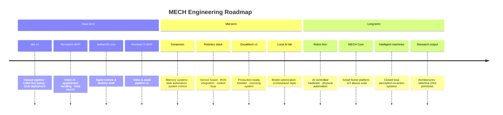

  

# Vaibhav Kumar

### Engineering intelligent systems at the intersection of AI, robotics, and product.

**AI & Robotics Builder** · **Desktop Software Engineer** · **Automation Architect** · **Founder @ MECH**

 

I design and ship systems that connect **local AI**, **computer vision**, **embedded hardware**, and **desktop software** into products people can actually use — not demos that stop at the notebook.

From a **1M+ conversation dataset** powering an anime AI companion, to a **robotic arm** that bridges software decisions to the physical world — I build with urgency and think in systems.

**Current focus:** MECH ecosystem · Mio AI companion · Reception startup · AetherXD · Revolver D

 

---

## Builder Philosophy

> Ship systems, not snippets. Optimize for leverage over novelty.

| Principle | In practice |
| :--- | :--- |
| **Systems thinking** | Compose agents, models, hardware, and UI into coherent workflows — not isolated scripts. |
| **AI + robotics integration** | Bridge perception, control, and inference so software decisions reach the physical world. |
| **Product discipline** | Every build must solve a real problem, survive daily use, and scale with the user's ambition. |
| **Local-first intelligence** | Train, optimize, and deploy models where latency, privacy, and ownership matter. |
| **Long-horizon engineering** | Favor architectures that compound — reusable primitives, clean interfaces, documented trade-offs. |

---

## MECH Ecosystem

> **MECH** is the company that connects every product into one coherent platform — instead of shipping random standalone apps, every build feeds into a larger, compounding system.

 

<table>
<tr>
<td width="50%" valign="top">

### 🤖 Mio — AI Companion

Flagship anime-inspired conversational AI. Built on a **1M+ conversation dataset**, local LLM-powered, designed for long-term memory and deep personalization — not just another chatbot. The long-term goal: your own intelligent companion that evolves with you, not a product you consume.

`Local LLM` · `1M+ Dataset` · `LoRA Training` · `Long-term Memory` · `Anime AI`

</td>
<td width="50%" valign="top">

### 🤖 Doraemon — Personal AI Assistant

The vision: an AI that **remembers everything**, helps with work, talks naturally, automates tasks, and eventually controls other systems. Not a product — a companion that genuinely feels like having your own Doraemon. The blueprint for what personal AI should become.

`Memory Systems` · `Task Automation` · `System Control` · `Multi-agent` · `Personal AI`

</td>
</tr>
<tr>
<td width="50%" valign="top">

### 🏢 Reception — AI Receptionist

B2B startup product under MECH. Handles **visitor management**, appointment scheduling, AI-driven conversations, and company assistance — built for both international and India market deployment.

`Visitor Management` · `Appointment AI` · `B2B SaaS` · `India + International` · `Conversational AI`

</td>
<td width="50%" valign="top">

### 📂 DocaMech — Auto File Organizer

Watches your Downloads folder and automatically sorts files — images, PDFs, videos, code, datasets, archives. Ships with a **licensing system** and **Windows installer**. One of the earliest serious software ideas, now being hardened into a real product.

`File Automation` · `Python` · `Windows App` · `Installer` · `Licensing`

</td>
</tr>
</table>

---

## Featured Projects

<table>
<tr>
<td width="50%" valign="top">

### ⚡ AetherXD

**AI-powered desktop ecosystem**

A unified local platform combining **automation**, **AI agents**, **local model inference**, **productivity tooling**, and **system-level control** — designed as a daily-driver environment for builders who want intelligence on their machine, not only in the cloud.

`Desktop` · `Agents` · `Automation` · `Local LLMs` · `System Integration`

</td>
<td width="50%" valign="top">

### 🎬 Revolver D

**AI-assisted content creation platform**

An end-to-end pipeline for **video production**, **design automation**, **asset generation**, and **workflow acceleration** — reducing creative iteration time through intelligent tooling and structured pipelines.

`Content AI` · `Video` · `Design Automation` · `Asset Gen` · `Workflows`

</td>
</tr>
<tr>
<td width="50%" valign="top">

### 🛡 Crime Detection Dashboard

**Hackathon build**

Crime heatmaps, AI assistant, pattern analysis, and a full-stack dashboard — backend, frontend, and Docker deployment all shipped under competition constraints.

[`Project-sentinal`](https://github.com/brovk2008/Project-sentinal)

`Crime AI` · `Heatmaps` · `Dashboard` · `Docker` · `FastAPI`

</td>
<td width="50%" valign="top">

### 🎥 VTuber / AI Avatar

**Anime avatar system**

VRM avatars + VSeeFace + Unity/Godot + MediaPipe body & hand tracking + OBS integration — building a real-time AI-driven streaming presence from the ground up.

`VRM` · `VSeeFace` · `MediaPipe` · `Unity` · `Blender` · `OBS`

</td>
</tr>
<tr>
<td width="50%" valign="top">

### 👁 Computer Vision

**Perception in real time**

Detection, tracking, and AI-assisted vision — from applied ML pipelines to deployable perception services.

[`emotion-detection-project`](https://github.com/brovk2008/emotion-detection-project) · [`rain-detect`](https://github.com/brovk2008/rain-detect)

`OpenCV` · `MediaPipe` · `Pose Estimation` · `Real-time CV` · `Flask`

</td>
<td width="50%" valign="top">

### 🧰 Dataset Toolkit

**The backbone of Mio's training pipeline**

Scripts for subtitle cleaning, CSV fixing, dataset extraction, language filtering, JSON conversion, and massive text processing — what started as one-off utilities became a reusable engineering backbone.

`Data Engineering` · `1M+ Rows` · `Pandas` · `Text Normalization` · `Pipeline`

</td>
</tr>
<tr>
<td width="50%" valign="top">

### 🧠 Local LLM Lab
**Experimentation environment**

Tested Qwen, Mistral, Zephyr, Gemini, and Ollama across real workloads — comparing RAM usage, inference speed, extraction quality, and accuracy to inform local deployment decisions across products.

`Qwen` · `Mistral` · `Zephyr` · `Ollama` · `Hugging Face` · `Model Evaluation`

</td>
<td width="50%" valign="top">

### 🌐 Local AI Research
**Train · optimize · deploy · orchestrate**

Research and implementation around RAG pipelines, model training from scratch, and local inference orchestration — prioritizing ownership, latency, and reproducibility.

[`RAG-for-IBM`](https://github.com/brovk2008/RAG-for-IBM) · [`Basic_ai_from_scratch`](https://github.com/brovk2008/Basic_ai_from_scratch)

`RAG` · `Embeddings` · `Fine-tuning` · `Inference` · `Python`

</td>
</tr>
<tr>
<td width="50%" valign="top">

### 🔬 Robotics & Embedded
**Hardware → software → intelligence**

Experiments across embedded systems, control logic, sensor integration, ROS, and Unity-based simulation — building the foundation for intelligent machines that perceive, decide, and act.

`ROS` · `Embedded` · `Unity` · `Control Systems` · `Sensor Integration`

</td>
<td width="50%" valign="top">

### 🚀 Shipped & Applied
**Products and competitions with real constraints**

[`weather-checking`](https://github.com/brovk2008/weather-checking) — deployed weather utility
[`mindmendor`](https://github.com/brovk2008/mindmendor) — mental health assistant bot
[`Project-sentinal`](https://github.com/brovk2008/Project-sentinal) — H2S datathon build

`TypeScript` · `Vercel` · `Hackathons` · `Applied AI`

</td>
</tr>
</table>

---

## Hardware Ambitions

> The long game: every software system I build is eventually meant to reach the physical world.

<table>
<tr>
<td width="33%" valign="top">

### 🤖 Robot Arm

A robotic arm controlled through custom AI — becoming part of a larger automation ecosystem where software decisions physically execute in real space.

`Embedded` · `Control Systems` · `AI Integration`

</td>
<td width="33%" valign="top">

### 🚆 Rail System

Rail-mounted automation that moves equipment around a workspace automatically — infrastructure for a smart, programmable physical environment.

`Hardware` · `Automation` · `Workspace`

</td>
<td width="33%" valign="top">

### 🏠 MECH Core — Smart Home

One platform, multiple devices — same electronics and firmware reused across products: Tank Level Checker (TLC) · Auto Motor Controller (AMC) · Leak Detector · Environment Monitor.

`IoT` · `Embedded` · `Sensor Fusion` · `Platform`

</td>
</tr>
<tr>
<td width="33%" valign="top">

### 📽 Smart Projector

Dynamic information projection into workspace — part of a future smart room where AI assistants and data live on surfaces, not just screens.

`Smart Room` · `Projection` · `AI Display`

</td>
<td width="33%" valign="top">

### 🥽 VR Workspace

An immersive virtual environment where AI assistants and productivity tools converge — exploring what a futuristic builder workspace could actually feel like.

`VR` · `Spatial Computing` · `AI Integration`

</td>
<td width="33%" valign="top">

### 🌐 Portfolio & Infrastructure
**Ongoing**

The deployment layer that keeps everything running: GitHub · Docker · Vercel · Netlify · APIs · Linux · WSL · CI/CD pipelines. Not a product — the backbone behind all of them.

`DevOps` · `Deployment` · `CI/CD` · `Linux`

</td>
</tr>
</table>

---

## Technology Stack

<b>Languages</b>

 

<b>AI / ML</b>

 

<b>Computer Vision</b>

 

<b>Data Engineering</b>

 

-150458?style=flat-square)

<b>Desktop Development</b>

 

<b>Backend · Frontend · Database</b>

 

<b>DevOps · Cloud · Infrastructure</b>

 

<b>Hardware · Embedded · Robotics</b>

 

<b>OS · Environment · Tooling</b>

 

---

## Skill Depth

| Area | Level | Notes |
| :--- | :---: | :--- |
| Python | `★★★★★` | Daily driver — AI, data, backend, automation |
| AI / LLMs | `★★★★☆` | Fine-tuning, RAG, local deployment, API integration |
| Data Processing | `★★★★★` | 1M+ row pipelines, cleaning, normalization |
| Backend | `★★★★☆` | FastAPI, Flask, Node, REST APIs, auth patterns |
| Startup / Product | `★★★★☆` | MVP planning, SaaS thinking, feature prioritization |
| Git / GitHub | `★★★★☆` | Version control, CI/CD, Actions workflows |
| Computer Vision | `★★★☆☆` | OpenCV, MediaPipe, real-time processing |
| Docker | `★★★☆☆` | Containerization, Compose, deployment |
| Linux | `★★★☆☆` | CLI, WSL, scripting, environment management |
| Web Development | `★★★☆☆` | React, Next.js, Tailwind, REST |
| DevOps | `★★★☆☆` | CI/CD, cloud platforms, infra |
| ROS | `★★☆☆☆` | Concepts, navigation, sensor integration |
| Unity / Godot | `★★☆☆☆` | Simulation, avatars, 3D environments |

---

## GitHub Analytics

  

  

  

---

## Engineering Roadmap

| Horizon | Goals |
| :--- | :--- |
| **Near-term** | Mio v1 · Reception launch · AetherXD agent runtime · Revolver D content MVP |
| **Mid-term** | Doraemon memory layer · Robotics perception-control loop · DocaMech production release |
| **Long-term** | Robot arm AI control · MECH Core smart home · autonomous intelligent systems |

---

## Collaboration

I collaborate with people who build with urgency and think in systems.

| | |
| :---: | :--- |
| **Contributors** | Help shape open modules from AetherXD, Revolver D, Mio, and CV tooling |
| **Researchers** | Co-explore local inference, robotics perception, and agent architectures |
| **Developers** | Pair on hard problems across desktop, backend, embedded, and AI stacks |
| **Hackathon teams** | Ship fast under constraints — I bring full-stack + AI integration |
| **Founders & builders** | Exchange ideas on product architecture, automation, and technical strategy |

 

**Open to:** research collaborations · hackathon teams · selective co-building · technical advisory

---

### Connect

 

Building the infrastructure for intelligent machines — one system at a time.

