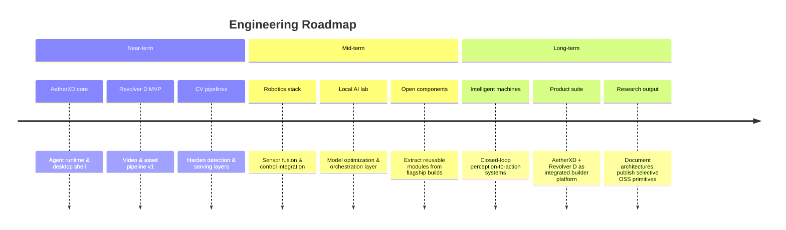

  

# Vaibhav Kumar

### Engineering intelligent systems at the intersection of AI, robotics, and product.

**AI & Robotics Builder** · **Desktop Software Engineer** · **Automation Architect**

 

I design and ship systems that connect **local AI**, **computer vision**, **embedded hardware**, and **desktop software** into products people can actually use — not demos that stop at the notebook.

**Current focus:** AetherXD desktop ecosystem · Revolver D content pipeline · robotics & perception R&D

 

---

## Builder Philosophy

> Ship systems, not snippets. Optimize for leverage over novelty.

| Principle | In practice |
| :--- | :--- |
| **Systems thinking** | Compose agents, models, hardware, and UI into coherent workflows — not isolated scripts. |
| **AI + robotics integration** | Bridge perception, control, and inference so software decisions reach the physical world. |
| **Product discipline** | Every build must solve a real problem, survive daily use, and scale with the user's ambition. |
| **Local-first intelligence** | Train, optimize, and deploy models where latency, privacy, and ownership matter. |
| **Long-horizon engineering** | Favor architectures that compound — reusable primitives, clean interfaces, documented trade-offs. |

---

## Featured Work

<table>
<tr>
<td width="50%" valign="top">

### AetherXD

**AI-powered desktop ecosystem**

A unified local platform combining **automation**, **AI agents**, **local model inference**, **productivity tooling**, and **system-level control** — designed as a daily-driver environment for builders who want intelligence on their machine, not only in the cloud.

`Desktop` · `Agents` · `Automation` · `Local LLMs` · `System Integration`

</td>
<td width="50%" valign="top">

### Revolver D

**AI-assisted content creation platform**

An end-to-end pipeline for **video production**, **design automation**, **asset generation**, and **workflow acceleration** — reducing creative iteration time through intelligent tooling and structured pipelines.

`Content AI` · `Video` · `Design Automation` · `Asset Gen` · `Workflows`

</td>
</tr>
<tr>
<td width="50%" valign="top">

### Robotics & Embedded

**Hardware → software → intelligence**

Experiments across **embedded systems**, **control logic**, **sensor integration**, and **Unity-based simulation** — exploring how intelligent machines perceive, decide, and act in real environments.

`Embedded` · `Control Systems` · `Unity` · `Automation` · `Hardware`

</td>
<td width="50%" valign="top">

### Computer Vision

**Perception in real time**

Building blocks for **detection**, **tracking**, and **AI-assisted vision** — from applied ML pipelines to deployable perception services.

[`emotion-detection-project`](https://github.com/brovk2008/emotion-detection-project) · [`rain-detect`](https://github.com/brovk2008/rain-detect)

`OpenCV` · `Real-time CV` · `Flask` · `Model Serving`

</td>
</tr>
<tr>
<td width="50%" valign="top">

### Local AI Research

**Train · optimize · deploy · orchestrate**

Research and implementation around **RAG pipelines**, **model training from scratch**, and **local inference orchestration** — prioritizing ownership, latency, and reproducibility.

[`RAG-for-IBM`](https://github.com/brovk2008/RAG-for-IBM) · [`Basic_ai_from_scratch`](https://github.com/brovk2008/Basic_ai_from_scratch)

`RAG` · `Embeddings` · `Fine-tuning` · `Inference` · `Python`

</td>
<td width="50%" valign="top">

### Shipped & Applied Work

**Products and competitions with real constraints**

[`weather-checking`](https://github.com/brovk2008/weather-checking) — deployed weather utility · [`Project-sentinal`](https://github.com/brovk2008/Project-sentinal) — H2S datathon build · [`mindmendor`](https://github.com/brovk2008/mindmendor) — mental health assistant bot

`TypeScript` · `Vercel` · `Hackathons` · `Applied AI`

</td>
</tr>
</table>

---

## Technology Stack

<b>Languages</b>

 

<b>AI / ML</b>

 

<b>Desktop Development</b>

 

<b>Backend · Frontend · Data</b>

 

<b>DevOps · Cloud · Hardware · Tools</b>

 

---

## GitHub Analytics

  

  

  

---

## Current Objectives

| Horizon | Goals |
| :--- | :--- |
| **Near-term** | Ship AetherXD agent runtime · Revolver D content MVP · production-grade CV serving |
| **Mid-term** | Robotics perception-control loop · local model orchestration · open-source core modules |
| **Long-term** | Autonomous intelligent systems · integrated AI product platform · public technical research |

---

## Collaboration

I collaborate with people who build with urgency and think in systems.

| | |
| :---: | :--- |
| **Contributors** | Help shape open modules from AetherXD, Revolver D, and CV tooling |
| **Researchers** | Co-explore local inference, robotics perception, and agent architectures |
| **Developers** | Pair on hard problems across desktop, backend, and embedded stacks |
| **Hackathon teams** | Ship fast under constraints — I bring full-stack + AI integration |
| **Founders & builders** | Exchange ideas on product architecture, automation, and technical strategy |

 

**Open to:** research collaborations · hackathon teams · selective co-building · technical advisory

---

### Connect

 

Building the infrastructure for intelligent machines — one system at a time.

