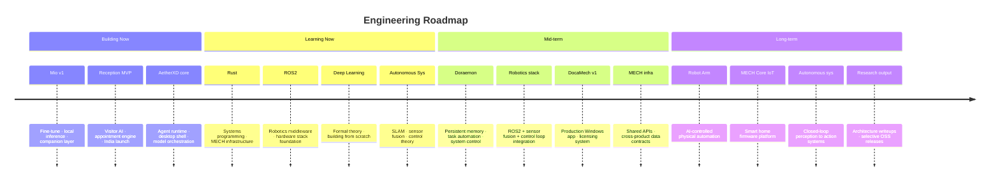

  

 

<h1 align="center">Vaibhav Kumar</h1>

  Building intelligent systems and AI software at <strong>MECH</strong>. 
  Local LLMs &nbsp;·&nbsp; Computer Vision &nbsp;·&nbsp; Robotics &nbsp;·&nbsp; Desktop Software &nbsp;·&nbsp; Autonomous Systems

  
  &nbsp;
  
  &nbsp;
  

---

## About

I'm building MECH — an AI and robotics startup. Day to day: training language models on custom datasets, writing real-time computer vision pipelines, shipping desktop software, and prototyping embedded hardware.

The technical direction is toward systems where AI reasoning connects directly to physical actuation. Companion AI, B2B SaaS, and desktop tools are the near-term products. Autonomous hardware is where the work is heading.

Currently focused on Mio, an AI companion fine-tuned on a 1M+ conversation dataset, and Reception, an AI receptionist platform. Learning Rust and ROS2 for the infrastructure and robotics work ahead.

---

## MECH

  <em>An AI &amp; Robotics startup. Every product contributes to a single long-term ecosystem — software intelligence connected to physical hardware, where each layer makes the next one possible.</em>

 

**Software Products**

| Product | Category | What it solves | Status |
|:--------|:---------|:---------------|:------:|
| **Mio** | AI Companion | Conversational AI that builds genuine long-term context. Fine-tuned on 1M+ conversation pairs, local LLM, no cloud dependency | `Active` |
| **Reception** | B2B SaaS | AI receptionist for offices — visitor management, appointment scheduling, natural conversation. India and international markets | `Active` |
| **AetherXD** | Desktop Platform | Local agent runtime and automation shell. AI on your machine, not routed through the cloud | `Active` |
| **Revolver D** | Content Pipeline | AI-assisted video production and design automation. Reduces iteration time for independent creators | `Active` |
| **DocaMech** | Utility | Automatic file organizer. Monitors a folder, auto-sorts by file type, ships as a licensed Windows application with installer | `Prototype` |
| **Doraemon** | Personal AI | Persistent memory, task automation, and system control. The infrastructure layer behind an AI that genuinely knows you — not a session-based chatbot | `Planned` |

 

**Hardware Vision**

| System | Description | Horizon |
|:-------|:------------|:-------:|
| **Robot Arm** | AI-controlled mechanical actuation driven by the MECH software stack | `Future` |
| **MECH Core** | Shared IoT firmware platform: Tank Level Checker · Auto Motor Controller · Leak Detector · Environment Monitor — one codebase across products | `Planned` |
| **Rail System** | Automated workspace equipment transport via rail-mounted actuators | `Future` |
| **Smart Projector** | AI-driven dynamic information surfaces in physical space | `Concept` |
| **VR Workspace** | Spatial AI environment — productivity tooling embedded in an immersive workspace | `Concept` |

---

## Current Focus

**Building**

| Project | Stage |
|:--------|:------|
| **Mio v1** | Dataset pipeline complete → LoRA fine-tune on 1M+ corpus → local inference deployment |
| **Reception** | Feature-complete MVP → pricing → India go-to-market |
| **AetherXD** | Agent runtime core → desktop shell → local model orchestration layer |
| **MECH infrastructure** | Cross-product shared APIs, data contracts, and reusable primitive libraries |

 

**Learning**

| Subject | Why |
|:--------|:----|
| **Rust** | Systems programming for performance-critical MECH components and embedded targets |
| **ROS2** | Robotics middleware — the foundation for integrating the MECH hardware stack |
| **Deep Learning** | Formal study via fast.ai, deeplearning.ai, and implementing architectures from scratch |
| **Autonomous Systems** | SLAM, motion planning, sensor fusion, and control theory |
| **Embedded Systems** | Low-level hardware programming toward the MECH IoT platform |

 

**Research**

| Area | Direction |
|:-----|:----------|
| **Local inference** | Quantization, model compression, and edge deployment without cloud fallback |
| **Embodied AI** | Connecting perception and reasoning pipelines to physical actuation |
| **Agent architectures** | Multi-agent coordination over shared memory and task infrastructure |

---

## Technology

**Languages**

  

Python &nbsp;·&nbsp; TypeScript &nbsp;·&nbsp; JavaScript &nbsp;·&nbsp; C++ &nbsp;·&nbsp; C# &nbsp;·&nbsp; Rust <em>(learning)</em>

  

**AI / ML**

  

PyTorch &nbsp;·&nbsp; TensorFlow &nbsp;·&nbsp; Hugging Face Transformers &nbsp;·&nbsp; LangChain &nbsp;·&nbsp; Ollama &nbsp;·&nbsp; LoRA fine-tuning &nbsp;·&nbsp; RAG pipelines &nbsp;·&nbsp; local LLM deployment &nbsp;·&nbsp; model quantization &nbsp;·&nbsp; Gemini API &nbsp;·&nbsp; OpenAI API

  

**Computer Vision**

  

OpenCV &nbsp;·&nbsp; MediaPipe &nbsp;·&nbsp; pose estimation &nbsp;·&nbsp; hand tracking &nbsp;·&nbsp; real-time detection &nbsp;·&nbsp; Flask model serving

  

**Backend**

  

 

**Frontend**

  

 

**Desktop**

  

 

**3D & Simulation**

  

 

**Infrastructure**

  

 

**Databases**

  

 

**Hardware & Embedded**

  

Arduino &nbsp;·&nbsp; Raspberry Pi &nbsp;·&nbsp; ROS <em>(concepts)</em> &nbsp;·&nbsp; ROS2 <em>(learning)</em> &nbsp;·&nbsp; sensor integration &nbsp;·&nbsp; embedded control

---

## Projects

> MECH products are listed above. Below are research builds, engineering experiments, and applied work.

 

**Computer Vision**

`emotion-detection-project` &nbsp;—&nbsp; Real-time facial emotion recognition. Built to run as a deployable service, not just a demo.
[→ View](https://github.com/brovk2008/emotion-detection-project) &nbsp;·&nbsp; OpenCV · MediaPipe · Flask

`rain-detect` &nbsp;—&nbsp; Computer vision utility for detecting weather conditions from live camera feeds.
[→ View](https://github.com/brovk2008/rain-detect) &nbsp;·&nbsp; OpenCV · Python

 

**Local AI Research**

`RAG-for-IBM` &nbsp;—&nbsp; Retrieval-augmented generation pipeline for document Q&A. Built under competition constraints.
[→ View](https://github.com/brovk2008/RAG-for-IBM) &nbsp;·&nbsp; LangChain · embeddings · vector search

`Basic_ai_from_scratch` &nbsp;—&nbsp; Core deep learning primitives implemented without frameworks. Forward pass, backpropagation, loss functions — no abstraction layers. Study project running alongside formal Deep Learning Specialization coursework.
[→ View](https://github.com/brovk2008/Basic_ai_from_scratch) &nbsp;·&nbsp; Python · NumPy

 

**Dataset Engineering**

`Dataset Toolkit` &nbsp;—&nbsp; Internal pipeline for cleaning, normalizing, and structuring large text corpora at scale. Handles 1M+ row datasets. Became the backbone of Mio's training data preparation — subtitle cleaning, CSV repair, language filtering, JSON conversion, and batch text normalization.
Private &nbsp;·&nbsp; Pandas · Python · multiprocessing

 

**Robotics & Embedded**

`Robotics & Embedded R&D` &nbsp;—&nbsp; Experiments in embedded control, sensor integration, ROS architecture, and Unity-based simulation. Foundation work for the MECH hardware roadmap — these are not finished products, they are learning infrastructure.
Arduino · Raspberry Pi · ROS · Unity

 

**Local LLM Lab**

Benchmarking environment for Qwen, Mistral, Zephyr, Gemini, and Ollama-hosted models. Evaluates RAM footprint, inference speed, and output quality to make integration decisions across MECH products. Ongoing rather than a single repository.
Ollama · Hugging Face · quantization testing

 

**VTuber / AI Avatar Research**

Real-time avatar pipeline: VRM model → VSeeFace → MediaPipe body and hand tracking → OBS output. Research into AI-driven character animation and streaming presence. Exploring intersection of real-time pose capture and generative AI.
VRM · VSeeFace · MediaPipe · Unity · Blender

 

**Applied & Shipped**

`Project-sentinal` &nbsp;—&nbsp; Full-stack crime pattern analysis platform. Crime heatmaps, AI assistant, pattern detection, Docker deployment. Built for the H2S datathon.
[→ View](https://github.com/brovk2008/Project-sentinal) &nbsp;·&nbsp; FastAPI · React · Docker

`mindmendor` &nbsp;—&nbsp; Mental health assistant chatbot.
[→ View](https://github.com/brovk2008/mindmendor) &nbsp;·&nbsp; TypeScript · Vercel

`weather-checking` &nbsp;—&nbsp; Deployed weather utility application.
[→ View](https://github.com/brovk2008/weather-checking) &nbsp;·&nbsp; TypeScript · Vercel

---

## Research Interests

**Local AI Inference** &nbsp;—&nbsp; Cloud dependency is a design flaw in most AI products. Model compression, quantization, and edge deployment are engineering problems worth solving well. Most of what MECH ships needs to work offline and on consumer hardware.

**Embodied AI** &nbsp;—&nbsp; The gap between a model that reasons well and a robot that acts correctly is still enormous. I'm interested in the perception-to-action pipeline: how a system observes the world, builds a representation, and executes physical decisions reliably.

**Human-AI Interaction** &nbsp;—&nbsp; Most AI products reset context between sessions. Mio is an early attempt to build something different — a companion system that accumulates history, maintains consistency, and becomes more useful over time rather than starting fresh each conversation.

**Autonomous Navigation** &nbsp;—&nbsp; SLAM, sensor fusion, and motion planning are the technical foundation for anything MECH builds that moves. I'm working through these areas systematically as part of the ROS2 and robotics learning track.

**Agent Architectures** &nbsp;—&nbsp; How do you build a system where multiple specialized agents coordinate over shared state without becoming brittle? AetherXD explores this at the desktop level. The same problems appear at much larger scale in robotics.

**Embedded Intelligence** &nbsp;—&nbsp; Running capable inference on constrained hardware without a cloud fallback. Central to making MECH IoT and hardware products viable as standalone devices.

---

## Engineering Roadmap

---

## GitHub Analytics

  
  &nbsp;
  

    

  

    

  
  &nbsp;
  

    

  

    

  <picture>
    <source
      media="(prefers-color-scheme: dark)"
      srcset="https://raw.githubusercontent.com/brovk2008/brovk2008/output/github-contribution-grid-snake-dark.svg"
    />
    <source
      media="(prefers-color-scheme: light)"
      srcset="https://raw.githubusercontent.com/brovk2008/brovk2008/output/github-contribution-grid-snake.svg"
    />
    
  </picture>

> **Snake setup:** add the workflow below at `.github/workflows/snake.yml` in your profile repo and push. GitHub Actions will auto-generate the animation and commit it to the `output` branch. The snake runs on your real contribution graph, eating each square as it moves.

---

## Collaboration

Open to working with people who are specific about what they're building and why.

| | |
|:--|:--|
| **Researchers** | Local inference, embodied AI, robotics perception, agent architectures |
| **Engineers** | Desktop software, embedded systems, AI infrastructure, robotics middleware |
| **Founders** | Technical co-building and product architecture for AI and robotics startups |
| **Hackathon teams** | Full-stack AI integration under real constraints and tight deadlines |

**Formats:** research collaboration &nbsp;·&nbsp; selective co-building &nbsp;·&nbsp; technical advisory &nbsp;·&nbsp; hackathons

 

---

  
    <a href="https://github.com/brovk2008">GitHub</a>
    &nbsp;·&nbsp;
    <a href="https://www.linkedin.com/in/vaibhav-kumar-347506251/">LinkedIn</a>
    &nbsp;·&nbsp;
    <a href="https://x.com/vaibhav6312">X</a>
  
    
  Building MECH — one system at a time.

