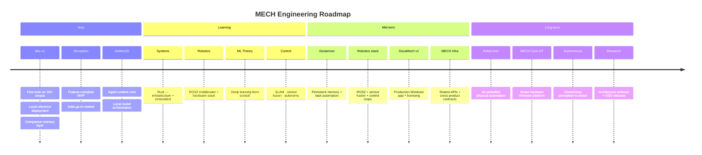

 

 

&nbsp;

&nbsp;

&nbsp;

---

 

## `whoami`

I'm building **MECH** — an AI and robotics startup.

Day to day: training language models on custom datasets, writing real-time computer vision pipelines, shipping desktop software, prototyping embedded hardware.

The long arc: systems where AI reasoning connects directly to physical actuation. The near-term is software — companion AI, B2B SaaS, desktop tools. The destination is autonomous hardware.

Currently deep in **Mio** (AI companion fine-tuned on 1M+ conversation pairs) and **Reception** (AI receptionist for offices). Learning **Rust** and **ROS2** for the infrastructure and robotics work ahead.

 

---

## `mech --stack`

 

**Languages**

Python &nbsp;·&nbsp; TypeScript &nbsp;·&nbsp; JavaScript &nbsp;·&nbsp; C++ &nbsp;·&nbsp; C# &nbsp;·&nbsp; Rust <em>(learning)</em>

  

**AI / ML**

PyTorch &nbsp;·&nbsp; TensorFlow &nbsp;·&nbsp; Hugging Face Transformers &nbsp;·&nbsp; LangChain &nbsp;·&nbsp; Ollama &nbsp;·&nbsp; LoRA fine-tuning &nbsp;·&nbsp; RAG pipelines &nbsp;·&nbsp; local LLM deployment &nbsp;·&nbsp; model quantization &nbsp;·&nbsp; Gemini API &nbsp;·&nbsp; OpenAI API

  

**Computer Vision**

OpenCV &nbsp;·&nbsp; MediaPipe &nbsp;·&nbsp; pose estimation &nbsp;·&nbsp; hand tracking &nbsp;·&nbsp; real-time detection &nbsp;·&nbsp; Flask model serving

  

**Backend**

 

**Frontend**

 

**Desktop**

 

**3D & Simulation**

 

**Infrastructure**

 

**Databases**

 

**Hardware & Embedded**

Arduino &nbsp;·&nbsp; Raspberry Pi &nbsp;·&nbsp; ROS <em>(concepts)</em> &nbsp;·&nbsp; ROS2 <em>(learning)</em> &nbsp;·&nbsp; sensor integration &nbsp;·&nbsp; embedded control

 

---

## `mech roadmap --view`

 

---

## `gh stats`

  

&nbsp;

  

  

&nbsp;

  

  

<picture>
  <source media="(prefers-color-scheme: dark)" srcset="https://raw.githubusercontent.com/brovk2008/brovk2008/output/github-contribution-grid-snake-dark.svg"/>
  <source media="(prefers-color-scheme: light)" srcset="https://raw.githubusercontent.com/brovk2008/brovk2008/output/github-contribution-grid-snake.svg"/>
  
</picture>

 

---

## `mech --collaborate`

Open to working with people who are specific about what they're building and why.

| Who | What |
|:----|:-----|
| **Researchers** | Local inference · embodied AI · robotics perception · agent architectures |
| **Engineers** | Desktop software · embedded systems · AI infrastructure · robotics middleware |
| **Founders** | Technical co-building and product architecture for AI and robotics startups |
| **Hackathon teams** | Full-stack AI integration under real constraints and tight deadlines |

**Formats:** research collaboration &nbsp;·&nbsp; selective co-building &nbsp;·&nbsp; technical advisory &nbsp;·&nbsp; hackathons

 

 

---

  
    <a href="https://github.com/brovk2008">GitHub</a>
    &nbsp;·&nbsp;
    <a href="https://www.linkedin.com/in/vaibhav-kumar-347506251/">LinkedIn</a>
    &nbsp;·&nbsp;
    <a href="https://x.com/vaibhav6312">X</a>
  
    
  Building MECH — one system at a time.

 

